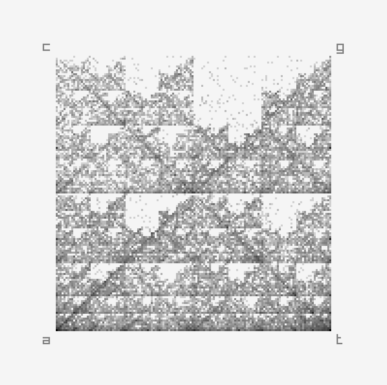

# Chaos Game Representation of Gene Structure

## Running

```console
./build.sh
./run.sh <file>
```

See `samples/index.txt` for a list of sequences you can visualize


## References

- H.Joel Jeffrey, Chaos game representation of gene structure,
  Nucleic Acids Research, Volume 18, Issue 8, 25 April 1990, Pages 2163–2170,
  https://doi.org/10.1093/nar/18.8.2163


## Demo


